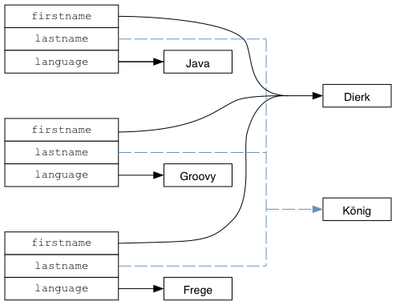
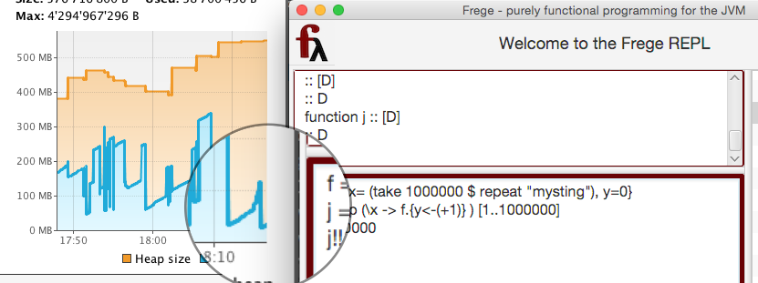

[[immutables]]
== Efficient Immutables

A cornerstone of functional programming is to work almost exclusively on values.
Values never change. 42 is 42 and when you apply the function
`(+1)` to it, then it will return 43 but 42 remains to be 42.

Values are immutable.

This is quite obvious for the case of numbers. But how about Strings? Most popular languages
treat them as immutable values. This has the benefit that we can safely
pass them around without worries that some other code may change their content.

Frege extends the benefits of immutability to all pure^*^ data structures,
including lists, maps and other standard data structures as well your self-made ones!

(*) _Pure means that the data structure doesn't announce any state change or other side effect in its type_.

This may sound totally unpractical when you come from an object-oriented background and you
may ask if that doesn't lead to extensive copying and memory exhaustion.
It turns out that when _consequently_ programming with values there is only a surprisingly small price to pay
for a huge number of benefits.

=== Custom Data Structures

Let's start with common, simple data structure: a `Person` that has a first name, a last name, and
thinks in a certain programming language.

.A simple Person data type
[source,frege]
----
data Person = Person { firstname, lastname, language :: String }

javaDierk   = Person "Dierk" "König" "Java"
----

When we create the `javaDierk` value of that `Person` type it is automatically immutable!

There are actually two separate features of the language that we see here:

* Frege has no assignments, so the `=` sign above denotes a _definition_ not an assignment.
  In particular, we cannot redefine `javaDierk` to point to some other person. Whoever references
  `javaDierk` will once and forever see the "thinking in Java" version of me.
* We cannot change the person value itself. But we can create new value, based on the given one.

.Changing a field creates a copy
[source,frege]
----
groovyDierk = javaDierk.{ language = "Groovy" }
fregeDierk  = javaDierk.{ language = "Frege"  }
----

[NOTE]
There are many interesting ways to work with the _record syntax_ that we will cover in a future post.

For now, we have three distinct `Person` values. With every change we get a
new copy. What looked like "setters" works actually more like a _copy constructor_.

But even though we have three copies, there is some automatic _structural sharing_ going on
as depicted in the following figure:

.Efficient immutables through structural sharing

Since we are _consequently_ working with values, we can _always_ safely share not only
String values as in the example above but _every_ value. Note that this property could not be achieved
if we would allow any kind of mutability to silently creep in.

But what if I have a really big data structure and make a real lot of changes to it?
Well, let's try. Assume we have a value of the data structure `D` with a field `x` that contains
a million Strings (maybe subject to lazy evaluation).
Then we update a second field `y` a million times. This will produce a million copies
and we are crazy enough to hold on to each and every copy to prevent early garbage collection.

Even this crazy scenario only produces the tiny rightmost blue hump in memory consumption that you see
in the magnifier glass below.

.Efficient, GC-friendly memory consumption

Note that the _list of Strings_ is just as immutable as a single String and can thus be safely shared
between all copies of `D`.

.Sharing is good
****
In his awesome talks, Venkat Subramaniam likes to mention that mom always told us: "sharing is good".

And, yes, I'm happy to share my toys with anybody, provided that nobody can break them - and that I can
retain a copy for myself (this is where most analogies with software tend to break).
****

It goes without saying that immutable data structures can not only be shared safely between
API providers and consumers in a single-threaded scenario but also between _concurrent_ and
massively _parallel_ computations.

The small price we pay is a little bit of temporary memory and some extra time for garbage collection.

.Immutable by default
[IMPORTANT]
The best of all: we did not write a single character to make all that work! +
We did not invest a single brain cycle. It is all automatic.

=== More Considerations
Deeply nested data structures are notoriously expensive to copy and to compare.
Immutable data structures can often alleviate that burden by just copying or comparing
one single reference.
A good example is what we called the "copy constructor". Beside setting the provided value(s),
it just copies the top-level references and, yet, it is a _deep copy_ anyway.

All standard data structures in Frege are immutable. This must be surprising if you come from the
OO world. We are so used that e.g. a map changes its content all the time. We may even consider
that to be a map's main purpose in life! Now is the time to reconsider that world view.
In the references you will find information and inspiration about that topic.

Now what is _dierk's_ current language that he thinks in? Which of the three references do we use?
Wouldn't it be better to keep just one reference around that points to "the latest"
`Person`? We will cover this scenario in a future post where we will also experience the
Frege "mechanics" that prevent such mutable state from undermining our immutable data structures.

=== References
[horizontal]
Chris Okasaki::
"Purely Functional Data Structures" +
http://www.amazon.com/Purely-Functional-Structures-Chris-Okasaki/dp/0521663504

Rich Hickey::
Keynote: The Value of Values +
http://www.infoq.com/presentations/Value-Values +
Persistent data structures +
https://www.youtube.com/watch?v=hb3rurFxrZ8 (min 20 ff)