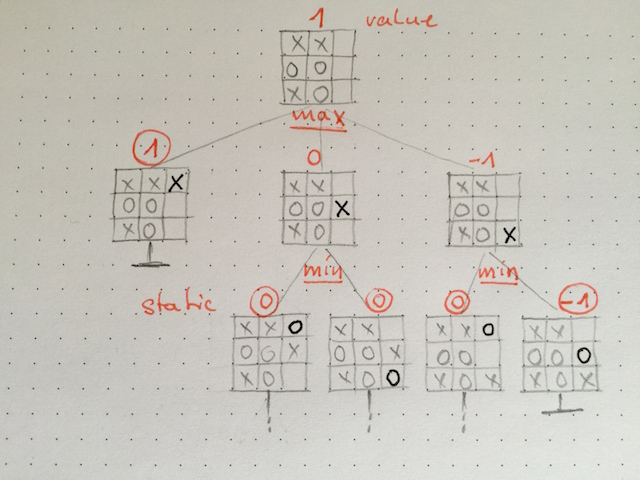

[[incremental_episode2]]
== Episode Two: Designing with functions and composition

In episode one, we have seen how lazy evaluation allows us to separate the generation of 
potentially infinite data structures from functions that work on it. 
We will now follow up on the same example from a different angle: 
how to design with functions for incremental development.

So far we have developed means for building a tree of game boards 
where child nodes represent the boards that result from the players mutually placing their moves.

In order to find the next best move we have to give some value to a board such that we can pick the one with the
highest value. Let's go with a _Double_ value where `1` represents that the computer has won and `-1` for the opponent. 
A function that tells us the static value of a board has this type:
[source, frege]
----
static :: Board -&gt; Double
----

For the purpose of our discussion, we don't need to know how it is implemented for our special game.
If you are curious, you find a simple valuation for the tic tac toe game
http://github.com/Dierk/fregePluginApp/blob/game_only/src/frege/fregepluginapp/Minimax.fr[here].

.A difference to object orientated design
****
Let's pause for a minute and think what we would do in object-oriented design now.
We may be tempted to make `static` a method of the `Board` type, right?
That would be beneficial because we can encapsulate the method with the data structure that it works upon,
especially when it uses internals of the board or makes assumptions about them. +
The downside is that when we change our mind on how to _use_ the board, this becomes an _intrusive_ change. +
In Frege, we keep our options open but we can retain the benefits of encapsulation by putting data structures
and functions thereof in the same _module_.
****

So when we consider our possible moves, we would pick the one that leads to the board with the highest value -
at least if we only look one move ahead. As soon as we look a little further, we also have to consider what our opponent does.
It is reasonable to assume that he will also do his best move, which for him is the one with the lowest value.
And he in turn will assume that we do our best, and so it goes on.

That is to say that the static value of a board is only interesting for the leaves in our tree.
All other values are derived from the maximum/minimum value one level below.
Here is a figure that calculates the next move for a given board.
Note that the static valuation is in circles, the minimax value has no circle around it.

.The minimax tree.

Here is the natural way of putting this into a functional design:
[source, frege]
----
maximize :: Ord a =&gt; Tree a -&gt; a
maximize (Node a []) = a
maximize (Node a children) = maximum (map minimize children)

minimize :: Ord a =&gt; Tree a -&gt; a
minimize (Node a []) = a
minimize (Node a children) = minimum (map maximize children)
----

Is this really "natural"? Yes.
The functional way assumes the least what is needed (the "weakest precondition" like in Hoare proofs).
In order to minimax a tree, we only need to assume that the payload can be ordered in some way
(in Java terms, it is "comparable"). In the type annotation `Tree a -&gt; a` the "a" is a type variable.
It tells that our method maps from a tree of "a" payloads to a value of exactly that type "a".
The only thing that we assume about the "a" type is the `Ord a =&gt;` constraint,
i.e. the "a" type must be an instance of the `Ord` typeclass such that we can call `minimum` and `maximum` 
on a list thereof.

There is a second indication that such an early abstraction is a normal thing to do:
we can totally delete the type declarations and let Frege infer the types. Guess what.
It will _exactly_ infer the types that we have given! What can be more natural than that?

Thanks to this early abstraction, we have a totally generic solution for the minimaxing of trees,
which is fully independent of our game trees. Again, we have made a _non-intrusive_ increment.

But does it work? In our game tree, "a" is of type `Board` and boards are not (yet) comparable.
This is where function composition appears again.
We have already seen it when we composed the pruning function with the `gameTree` to produce a
`prunedTree` as `prune 5 . gameTree`.
By the same means we can make a tree of boards into a tree of the `static` values of those boards.
[source, frege]
----
valueTree = static . prunedTree
----

Remember that the tree is not materialized! Only on demand when we access the children will they be built.
And so it is as well for the `static` function: nothing gets evaluated before we access the payload via `static board`.

The function that calculates the maximum value for a board is again a composition:
[source,frege]
----
maximize . valueTree
----

or in its expanded form:
[source, frege]
----
maxValue = maximize . static . prune 5 . gameTree
----

.Where is the board?
****
You may ask where the board is in this definition. After all, `maxValue` takes a board and returns a `Double`.
Where is the board parameter? Well we could bring it in but the definition above nicely shows that we don't care
about _function application_ at this point but _function definition_:
the `maxValue` _function_ is _composed_ from the _functions_ on the right. +
Note that the "=" sign denotes a _definition_, not an _assignment_. We never use assignments in pure functional programming.
****

We now have a set of functions that we can compose to our liking.
The compiler will infer all the types and makes sure that they properly line up.
For example, we cannot accidentally `maximize` a tree of values that don't define an order.
But we can have such trees - actually, `gameTree` is of that nature.

The types tell us that we can happily `prune` before or after calling `static`
while they catch errors such as putting `prune` in a place where it cannot work.

This is not only a nice toolbox to play with. It is _compositional_ in more than one meaning of the word.
We have come to this point in a fully _non-intrusive_, _incremental_ manner,
never going back to change previously defined functions or data types.

In episode three we will do incremental development with the help of higher-order functions and typeclasses.
The goal will be to show a forecast of how we think the game will develop.
