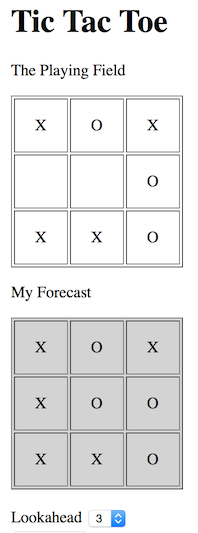

[[incremental_episode3]]
== Episode Three: Higher-order functions and data type evolution

In episode one we made the case for incremental development and the importance of staying _non-intrusive_.
What we will do now is changing code from the last increment.

image:stack_of_increments.png https://www.canoo.com/blog/wp-content/uploads/2015/01/Untitled-Drawing.png

.A stack of increments

Changing code is what we declared as being _intrusive_  but changing the _last_ increment is allowed.

The problem with changing code is that any code that depends on it may be compromised. That is the intrusion.
Since no code can possibly depend on the _last_ increment,  changing it is safe.

With that consideration out of the way, let's look at our last increment that finds the minimax value for a given board:

[source,haskell]
----
maxValue = maximize . static . prune 5 . gameTree
----
It works fine but we would like to make it even more _idiomatic _in the functional sense.

We have already seen that functional programmers like to introduce abstractions very early 
and there is a hidden abstraction in the code above.
We map a tree of boards to a tree of doubles. The structure of the tree remains untouched.
This is the nature of an abstraction called _Functor_.
Functors support a general function _fmap_ that keeps the current structure but applies a
function _f_ to all elements. It turns out that our _Tree_ type is such a
_Functor_.

To use the Functor nature of trees, we use _fmap f_ instead of _static_.

[source,haskell]
----
evaluateBy f = maximize . fmap f . prune 5 . gameTree

maxValue = evaluateBy static
----

Note that _evaluateBy_ now takes a parameter _f_, which can be any function that takes a _Board_ 
and returns an _Ord_ as required by _maximize_.

A function like _evaluateBy_ that takes another function as a parameter is called a
*_higher-order function_*.
They are heavily used in functional programming and in fact we have used them before without giving it any attention.
The current case, though, is different. We use this very common functional feature to set the stage
for _non-intrusive increments_.

=== A new requirement comes up: predicting the future

It appears that playing the game is fun but sometimes it is difficult to understand why the computer does a certain move.
It would be interesting if we had a some insight and could show what the computer is considering.
The idea is that we display a forecast: the final board that the computer thinks the game will develop into.

.Computer knows he will win.

To this end, we need to capture the board that led to the minimax value. It turns out that this is easier than expected.
We can use _evaluateBy_ but we do not pass the _static_ function any more.
Instead, we pass a function that maps a board not only to its static value but to a _pair_
of the static value and the board itself.

[source,haskell]
----
endValue = evaluateBy capture where
    capture board = (static board, board)
----
This is nice. First and foremost it is a fully _non-intrusive_ increment!
We did not change any existing code at all.

Second, it falls in place very naturally when following the functional style with higher-order functions -
without any anticipation of new requirements.

.Compare with OO
****
Think what would have happened if we followed a typical object-oriented style.
We can of course achieve similar effects in OO but this requires some forethought to prepare for new use cases:
template methods, strategy pattern, and the likes. Without such anticipation, OO design would lead to intrusive changes.
One way or the other: incremental development would be harder.
****

The downside is: it doesn't compile.

Our mapping function must return an _Ord_ but a pair (any tuple actually) is only of type _Ord_
if all its elements are of type _Ord_ as well. The _Double_ value is but the _Board_ type is not.

Hm, what next? Going back to the definition of _Board_ and changing its definition?
That would be an _intrusive _change.

Here we see a big benefit of Frege typeclasses (as opposed to let's say Java interfaces):
we can *evolve the data type!* _Board_ becomes an instance of the _Ord_
typeclass _non-intrusively_ in a new increment with full static type safety!

There is not much logic to add since we make all boards equal.
For the purpose of ordering our pairs we only need the _static_ _Double_ values of the pair.

[source,haskell]
----
instance Ord Board where (<=>) a b = EQ
----

This code looks so simple but the implications are huge. By making _Board_ an instance of _Ord_,
we have given the _Board_ type a new capability!

.Type evolution
****
Note that this even works when the source code of _Board_ is not available.
It can come from a third-party library that we only have in binary form. +
We can even *evolve* *foreign data types*.
****

Now we have everything compiling and working. You can
https://klondike.canoo.com/tictactoe/game[play the game] and see the forecast working.

In the next episode, we will apply a rather unconventional increment: going safely parallel.