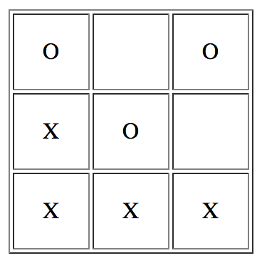

[[incremental_head]]
== Incremental Development

This is why functional programming _really_ matters:
_it provides new options for incremental development_.

After all, how do we create software? _One line at a time_. +
All software development is incremental.

We can approach this task in two ways: _intrusively_ or _non-intrusively_.
When we have to change and recompile existing code in order to proceed, we call this approach _intrusive_.

Of course, the best would be if we could apply increments _non-intrusively_, without touching any existing code at all
and without any fear of breaking existing code!
This is sometimes possible.

.Options for non-intrusive increments today
* Modular architectures allow to just add new components or services.
* In object-oriented systems we can use subtyping to add new implementations for existing abstractions.
* With dynamic languages, we can add new capabilities to existing classes.

But all of these options have their limitations.
They either work only for anticipated extensions or they come at the expense of increased complexity
or weakened type safety, which in the future makes it harder to extend the extensions again.

We would certainly profit if we had more ways of extending software safely.

Functional programming comes with such new options as John Hughes has shown in his seminal paper
http://www.cs.kent.ac.uk/people/staff/dat/miranda/whyfp90.pdf["Why functional programming matters"].
He puts it in terms of _modularity_ and new _glue_ for combining modules: high-order functions and lazy evaluation.

.Why do we strive for modularity?
****
Modularity is not an end in itself. It helps us constrain the effect of changes to a single module and lets us add and
remove modules without touching others. It allows us to work incrementally.
****

The paper is now 25 years old but still one of the best motivations for functional programming.
The examples are presented in the Miranda language, the predecessor of Haskell.
His line of argumentation accumulates in the last example: a generic solution for playing board games.

We take this very example and implement it in Frege over the course of 4 episodes,
following the steps as explained in the paper.
You may want to read it in parallel to better understand what we are doing, to deepen your understanding,
but first of all because it is just a joy to read.

As the specific board game we choose tic-tac-toc (aka noughts and crosses). It is pretty easy to visualize and
has simple rules that do not distract too much from the purpose of the exercise:
experiencing incremental development in Frege.

.The tic-tac-toe game.

https://klondike.canoo.com/tictactoe/game[Play the game.]

So let's begin with the first of four episodes.