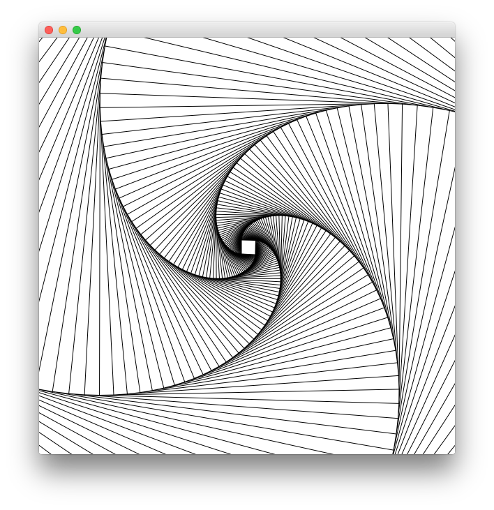

[[lists_as_streams_and_iterators]]

== Lists are Streams and Iterators

Lists are the most common data structure in Frege (just like in Haskell).

Coming from a Java background, one may expect a number of properties about
lists:

* how much space they take up in memory
* how they can be accessed
* how they can be modified
* what features are available
* how they can be iterated over
* how they relate to streams, iterators, sequences, and collections.

Many of these properties are profoundly different in Frege.
They are much more versatile and powerful. They can be infinitely large,
they can be used as streams, and they replace iterators and
sequences.

=== Memory consumption

Frege lists often use hardly any memory at all.
The most obvious example is the infinite list of all positive whole
numbers:

.An infinite list
[source,frege]
----
integers = [1..]
----

Though infinite, the `integers` list does *not* exhaust the memory.
Neither do other large lists of that kind:

.A large list
[source,frege]
----
large = [1..100_000_000]
----

Well, you might think that this special feature only works for
range-like lists but thanks to laziness, it is a feature that works
for all lists where the individual values are somehow derived:

.Other infinite lists
[source,frege]
----
-- derive next value from predecessor
cardinals = iterate (+1) 1

-- derive by repeating
toggles   = cycle [true, false]

-- derive by mapping
data BigData    = BigData { number :: Integer }
infiniteBigData = map BigData [1..]
----

It takes some practice for the Java programmer to let go his
innate worries about large lists and collective data structures in
general.

_First_: as long as the list is not evaluated, it takes up
only as much memory as the piece of logic ("thunk") that defines it.
This is almost no space at all.

_Second_: elements are only created when needed, e.g. asking for the
1000th element of `infiniteBigData` will only create _one_
BigData value (not 1000 of them).

=== Access and modify

It should come at no surprise that you can use the functions below
to get access to elements in the list. Access to a value at a given
index uses the `!!` operator.

.List functions that mostly do what you think they do
[source,frege]
----
head   [0..10]
last   [0..10]
length [0..10]
[0..10] !! 5

-- pattern match with cases
doWithHead []            = ... -- when empty
doWithHead (head : tail) = ... -- use head
----

You can see that Frege lists can be used like collections.
The collection functions have a catch, though.

.Know your lists
****
Calling `head` or `last` on an empty list or indexing outside the
list bounds cannot return a value.
It is undefined.

Calling `length` on an infinite list cannot work either.
On very large lists, it may be very slow or cause an stack overflow.
****

Collection-like functions are often better replaced with approaches like pattern matching
with case discrimination. Those are always safe.

=== Lists are immutable

The typical Java way to work with lists is to change them in-place.
This is *never* the case in Frege. Lists are immutable.

Java 8 streams work destructively: calling `skip(1)` on a stream
will modify the stream and the respective element is lost from the stream.
Not so in Frege where the following functions can be called on a
list just like their equivalents on Java streams but return an efficient
"copy" or "view" of the list. The original never changes.

.Lists as non-destructive streams
[source,frege]
----
drop 2 [0..10]
take 5 [0..10]
map    (+1)  [0..10]
filter (<10) [0..10]
fold   (+) 0 [0..10]
----

[NOTE]
Efficiency comes from the fact that the original list is immutable and thus
views on a sublist rarely have to copy anything. For example `drop 2` only
needs to set the starting point of the view two elements down the tail.

But lists are not only lazy collections and streams at the same time,
they can also be seen as iterators and sequences.

=== Lists as iterators

Iterators pass each element, one at a time, to a function that uses that element.

.Print the numbers 1 to 10
[source,frege]
----
for [1..10] println
----

[NOTE]
The `for` alias for `forM_` is available since version 3.22.524.
It has the additional benefit that it works not only on lists but
on any _ListSource_ (those have a `toList` function).

But there is more.

When a list contains actions (values of type `IO()`), then they become
essentially sequences of these actions with the help of the
`sequence` function.

.Executing all actions in sequence
[source,frege]
----
actions = map println [1..3]
sequence actions
----

=== Putting it all together

Let's print square numbers by using the techniques from above.
To make things a bit more interesting, we will calculate them
in a very basic way
by pure counting (without multiplication).

The trick is that any square number is a sum of uneven numbers
so we need those first. While there is a built-in facility in
Frege for that purpose (`[1,3..]`), let's for the fun of it
create our own stream of uneven numbers.

Starting at number 1, we get the next uneven number by adding
2 to the previous one.

.The stream of uneven numbers
[source,frege]
----
unevens = iterate (+2) 1
----

Now, to get the _n_'th square number, we need to add up the first
_n_ uneven number by folding them with the plus function.

.Adding up the first n uneven numbers
[source,frege]
----
square n = fold (+) 0 $ take n unevens
----

[NOTE]
Using the `sum` function would have been shorter but less interesting.

****
This would be a good time to think about what actually happens when you execute `square 3`.
****

Using the _square_ function (that works on the stream of _unevens_) we can now create a
stream of all squares by mapping the stream of all whole numbers to their squares.

.An infinite stream of squares
[source,frege]
----
squares = map square [1..]
----

For printing the _squares_, we could just evaluate them in the shell, which does the
printing for us. Otherwise, we can use the _squares_ themselves as the iterator
that we need for printing. Printing an infinite stream is not a good idea, though,
and therefore we limit the iteration to any slice that we are interested in.

.Iterate over an interesting slice
[source,frege]
----
for (take 10 $ drop 100 squares) println
----

=== A closing example

Thinking of Frege lists not only in terms of a collection but also as
streams, iterators, and sequences first takes a bit to get used to.
It is needed, though, to harness their full power.

The other day, I was trying to let Frege paint some paper doodle. It is about
connecting points and edges such that you get the illusion of a never-ending
staircase.

.Stairs doodle

Given a starting point and the logic how to calculate the next step, the code is literally (!)

[source,frege]
----
stairs = iterate step start
----

The doodle itself needs a graphics context for drawing
(and thus the FregeFX REPL) and the doodling itself is just the sequence connecting the calculated steps:

[source,frege]
----
doodle ctx = map (connect ctx) stairs
----

Note that up to this point, we are still _purely_ functional!
We have merely created an infinite list/stream/iteration of actions.

The effective painting is then done by limiting the sequence to a useful slice and passing it for
execution to the _paint_ function: `paint (sequence_ . take 500 . doodle)`.

It was this very example that made me appreciate the versatility of lists. It allows separating the
specification of _what to do_ from executing that specification. My first reaction was: "But that
may lead to large, memory-consuming lists!" and it took me a bit to understand why this is not the case.

=== References
[horizontal]
The FregeFX REPL::
https://github.com/Dierk/frepl-gui +
The latest Version contains the stairs doodle as an example of how to load code from the web.

Code of stairs doodle::
https://github.com/Dierk/frepl-gui/blob/master/Stairs.fr