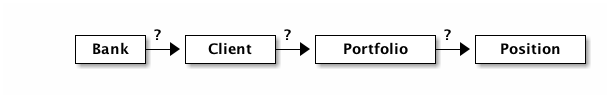

[[maybe_path]]
== The Maybe Path

In "<<fpath.adoc#fpath,List and Path>>" we have experienced how to construct path expressions
that are made up of list structures. We have also seen the `Maybe` type that signals
the (un-) availability of a value.

Today, we will see that the exact same kind of path expressions can arise when
multiple `Maybe` types are in play.

=== The domain model

Coming back to our banking domain model, we now assume that the bank may have a _star_
client (think "Warren Buffet"). He may have a favorite, best performing portfolio: his _star_
portfolio with the most heeded position being - you guessed it - the optional _star_ position.

.Stars in a simplified banking domain

Modeled with record syntax, the domain is easily expressed as below.
Note the similarity to the domain in "<<fpath.adoc#fpath,List and Path>>".
We only replace _list of_ types with _Maybe_ and adapt the names.

.The core domain data structures
[source,haskell]
----
data Bank       = Bank      { star   :: Maybe Client     }
data Client     = Client    { star   :: Maybe Portfolio  }
data Portfolio  = Portfolio { star   :: Maybe Position   }
data Position   = Position  { soMany :: Int, ticker :: Ticker }
----
NOTE: A `Position` always has a ticker, even though that makes our live a little harder later.
      We want to keep it a bit "realistic".

Now let's create an example bank with all optional values being available.

.The bank with all stars
[source,haskell]
----
starBank = Bank {
    star = Just Client {
        star = Just Portfolio {
            star = Just Position { soMany = 8, ticker = CANO }
        }
    }
}
----

But there may be other banks, where either no star client is known or he doesn't have a
preferred portfolio or there is no special position worth considering.

.Poor banks (hypothetical)
[source,haskell]
----
noStarBank      = Bank { star = Nothing }
noPortfolioBank = Bank { star = Just Client { star = Nothing } }
----

We may be foolish enough to think that we can make money by just investing
in the star client's favorite ticker. To make that happen, we first have to find it.

=== First cut

To find the star ticker, we have to find the star position (if any) of the
star portfolio (if any) of the star client (if any).

Let's make a `starTicker` function for that purpose that takes a `bank` and
if there is a star ticker, return just that and nothing otherwise.
In short, the type is
----
starTicker :: Bank -> Maybe Ticker
----

There are a number of straightforward ways of implementing this
(case discrimination, case expression, nested _if_, _maybe_ function), all of which
lead to an intricate solution similar to the one below.

.Works but is difficult to read
[source,haskell]
----
starTicker bank = starPortfolio bank.star where
    starPortfolio Nothing = Nothing
    starPortfolio (Just client) = starPosition client.star where
        starPosition Nothing = Nothing
        starPosition (Just portfolio) = starTicker portfolio.star where
            starTicker Nothing = Nothing
            starTicker (Just position) = Just position.ticker
----

Let's see whether this works as expected. Remember that _Nothing_ may appear anywhere
in the process and we need to make sure that we never fall off the ship.

.Testing
[source,haskell]
----
import Test.QuickCheck

star1 = once $ starTicker starBank        == Just CANO
star2 = once $ starTicker noStarBank      == Nothing
star3 = once $ starTicker noPortfolioBank == Nothing
----

While this approach works, we can certainly do better.

=== Improving on notation

Let's step back and reconsider what we are doing here.

Looking at the involved functions and their types we see a similar pattern as in "<<fpath.adoc#fpath,List and Path>>".

----
bank.star        --              Maybe Client    <1>
Client.star      -- Client    -> Maybe Portfolio <2>
Portfolio.star   -- Portfolio -> Maybe Position  <3>
Position.ticker  -- Position  -> Ticker
----

Each function returns a _Maybe_ of the type that the next function takes as the input.
So maybe we can generalize over this pattern and _bind_ the functions
such that we can put them in a line.

Binding <1> and <2> would be
----
<1>             <2>                            return type
Maybe Client -> (Client -> Maybe Portfolio) -> Maybe Portfolio
----

Binding <2> and <3> would be
----
<2>                <3>                              return type
Maybe Portfolio -> (Portfolio -> Maybe Position) -> Maybe Position
----

As you see, there is a general pattern behind it such that _bind_ has the type: +
`Maybe a -> (a -> Maybe b) -> Maybe b`

You will be glad to hear that this _bind_ function is already available and just like in the
cases of "<<easy_io.adoc#easy_io,Easy IO>>" and "<<fpath.adoc#fpath,List and Path>>", it is denoted with the `>>=` operator.

So combining <1> and <2> becomes
`bank.star >>= Client.star`

Combining <2> and <3> becomes
`Client.star >>= Portfolio.star`

Combining (<1> and <2>) and <3> becomes +
`bank.star >>= Client.star >>= Portfolio.star`

.Tadaaaa!
[IMPORTANT]
We have _again_ arrived at a simple "path" expression, this time for the optional star position of the optional star
portfolio of the optional star client!

To complete the task, here is the solution in a single path.

.Chaining Maybe values in a path
[source,haskell]
----
starTicker bank =
    bank.star >>= Client.star >>= Portfolio.star >>= \position -> Just position.ticker
----

If the `Position.ticker` would also be a _Maybe_ type then chaining would be even nicer.
But this variant is more realistic, since there can never be a position without a ticker.
It is also instructive to see this variant where the argument that is passed to the function
is captured in the lambda parameter.

We can simply follow the types. As we have seen in "<<silence.adoc#silence,Silent notation>>"
----
\position -> Just position.ticker   -- Position -> Maybe Ticker
----
is just another notation for
----
foo :: Position -> Maybe Ticker
foo position = Just position.ticker
----
and we spare the headaches of finding a good name for it.

=== The "do" notation, again

Meanwhile it should come at no surprise that where there is _bind_, the "do" notation is
just around the corner.

.The star ticker with "do" notation
[source,haskell]
----
starTicker bank = do
    warrenBuffet  &lt;- bank.star
    starPortfolio &lt;- warrenBuffet.star
    starPosition  &lt;- starPortfolio.star
    Just starPosition.ticker
----

This reads actually pretty nicely and works just like we want it. Note again that each step
may evaluate to a `Nothing` in which case the function returns _immediately_ `Nothing`
without any further step being evaluated.

=== Comparing approaches

The `Maybe` type turns out to be very versatile in both path expressions and
when used with the "do" notation.

Path expressions in other languages can also be rather succinct. Our running example
would for example be the Groovy GPath
`bank.star?.star?.star?.ticker`, returning _null_ if any step in path was _null_.

.There is no _null_.
****
Remember: there is no _null_ in Frege and thus no _NullPointerExceptions_.
One cannot say that often enough.
****

However, one cannot compare the visual appearance of the code only.

Frege has the advantage of carrying the _Maybe_ context through the type
system ensuring that the caller never forgets that the value may be unavailable.

Java would have a similar effect if its NullPointerException was a "checked
exception" (which it is not). There is an _Optional_ type since Java 8 with a
method `flatMap` that works similar to our _bind_. Time will tell how good
that abstraction works in Java.

=== References
[horizontal]
Groovy Null-Safe::
http://groovy-lang.org/operators.html#_safe_navigation_operator

Learn you a Haskell::
http://www.learnyouahaskell.com/a-fistful-of-monads

Java 8 Optionals::
http://www.oracle.com/technetwork/articles/java/java8-optional-2175753.html
(possibly contains some errors)